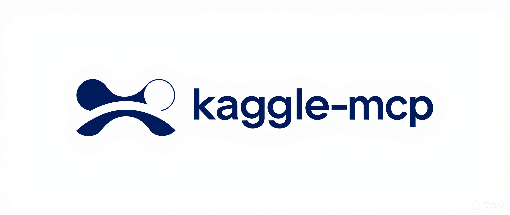
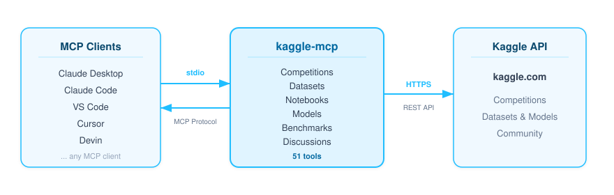

<p align="center">
  
</p>

> Ce dépôt est un **composant MCP du [Hephaistos-Kit](https://github.com/art-qalam-fr/Hephaistos-Kit)** —
> utilisable seul, mais conçu pour être cloné en sous-module et installé via `mcp/install.ps1`.
>
> 🙏 Adapté de [Galaxy-Dawn/kaggle-mcp](https://github.com/Galaxy-Dawn/kaggle-mcp) — merci aux développeurs originaux pour la base qui a permis cette intégration au kit.

---

<div align="center">



<!-- mcp-name: io.github.Galaxy-Dawn/kaggle-mcp -->

A full-featured MCP server for the Kaggle API — competitions, datasets, kernels, models, benchmarks, and discussions.

[](https://pypi.org/project/kaggle-mcp-server/)
[](https://opensource.org/licenses/MIT)
[](https://github.com/Galaxy-Dawn/kaggle-mcp/stargazers)
[](https://github.com/Galaxy-Dawn/kaggle-mcp/commits/master)

[English](README.md) | [中文](README.zh-CN.md)

</div>

## Why kaggle-mcp?

Kaggle provides an [official remote MCP server](https://www.kaggle.com/docs/mcp) (`https://www.kaggle.com/mcp`) covering competitions, datasets, notebooks, models, and benchmarks — a solid foundation for most Kaggle workflows.

**kaggle-mcp extends that foundation** with what the official server is missing: **10 discussion tools**. You can search discussions, browse by source type, filter competition discussions by recency, read solution write-ups, explore trending topics, and more — none of which are available in the official MCP.

It also runs locally over stdio, so there's no remote MCP dependency and no `npx mcp-remote` required.

**Use kaggle-mcp** if you need discussion tools or prefer a local stdio setup without remote dependencies.
**Use the official MCP** if you prefer OAuth 2.0 auth or want zero local installation.

<p align="center">
  
</p>

## Quick Navigation

| Section | Description |
|---------|-------------|
| [Prerequisites](#prerequisites) | Kaggle API token setup |
| [Installation](#installation) | uvx / pip / source |
| [Configuration](#configuration) | Claude Desktop, Claude Code, VS Code, Cursor |
| [Tools (51)](#tools-51) | Competitions, Datasets, Kernels, Models, Benchmarks, Discussions |
| [Debugging](#debugging) | MCP Inspector |
| [Development](#development) | Local development setup |

## Prerequisites

A Kaggle API token is required. You can authenticate using either method:

<details>
<summary><b>Option A: API Token (recommended)</b></summary>

1. Go to https://www.kaggle.com/settings → API → Create New API Token
2. Set the environment variable:

```bash
export KAGGLE_API_TOKEN="KGAT_xxxxxxxxxxxx"
```

</details>

<details>
<summary><b>Option B: kaggle.json</b></summary>

Download the token file from Kaggle settings, it will be saved to `~/.kaggle/kaggle.json`:

```json
{"username": "your_username", "key": "your_api_key"}
```

</details>

## Installation

> **Note:** MCP servers are launched automatically by MCP clients (Claude Code, VS Code, etc.) — **you don't need to run them manually in the terminal**. The commands below are what the client uses under the hood.

### Using uvx (recommended)

No installation needed. [uvx](https://docs.astral.sh/uv/guides/tools/) will automatically download and run the server:

```bash
# Used by MCP clients internally; no need to run this yourself
uvx kaggle-mcp-server
```

### Using pip

```bash
pip install kaggle-mcp-server
```

### From source

```bash
git clone https://github.com/Galaxy-Dawn/kaggle-mcp.git
cd kaggle-mcp
uv sync
```

## Configuration

### Claude Desktop

Add to your `claude_desktop_config.json`:

<details>
<summary>Using uvx (recommended)</summary>

```json
{
  "mcpServers": {
    "kaggle": {
      "command": "uvx",
      "args": ["kaggle-mcp-server"],
      "env": {
        "KAGGLE_API_TOKEN": "KGAT_xxxxxxxxxxxx"
      }
    }
  }
}
```

</details>

<details>
<summary>Using pip</summary>

```json
{
  "mcpServers": {
    "kaggle": {
      "command": "python",
      "args": ["-m", "kaggle_mcp.server"],
      "env": {
        "KAGGLE_API_TOKEN": "KGAT_xxxxxxxxxxxx"
      }
    }
  }
}
```

</details>

### Claude Code

```bash
claude mcp add kaggle -- uvx kaggle-mcp-server
```

Or add to your **project's** `.mcp.json` (not `settings.json`):

```json
{
  "mcpServers": {
    "kaggle": {
      "command": "uvx",
      "args": ["kaggle-mcp-server"],
      "env": {
        "KAGGLE_API_TOKEN": "KGAT_xxxxxxxxxxxx"
      }
    }
  }
}
```

### VS Code

[](https://vscode.dev/redirect/mcp/install?name=kaggle&config=%7B%22command%22%3A%22uvx%22%2C%22args%22%3A%5B%22kaggle-mcp-server%22%5D%7D) [](https://insiders.vscode.dev/redirect/mcp/install?name=kaggle&config=%7B%22command%22%3A%22uvx%22%2C%22args%22%3A%5B%22kaggle-mcp-server%22%5D%7D)

Add to `.vscode/mcp.json` (note: the key is **`"servers"`**, not `"mcpServers"`):

```json
{
  "servers": {
    "kaggle": {
      "command": "uvx",
      "args": ["kaggle-mcp-server"],
      "env": {
        "KAGGLE_API_TOKEN": "KGAT_xxxxxxxxxxxx"
      }
    }
  }
}
```

### Cursor

Add to `.cursor/mcp.json`:

```json
{
  "mcpServers": {
    "kaggle": {
      "command": "uvx",
      "args": ["kaggle-mcp-server"],
      "env": {
        "KAGGLE_API_TOKEN": "KGAT_xxxxxxxxxxxx"
      }
    }
  }
}
```

> **Tip:** If you already have `KAGGLE_API_TOKEN` in your **shell environment** (e.g. in `.bashrc` or `.zshrc`), you can omit the `"env"` block.

## Tools (51)

### Competitions (10)

| Tool | Description |
|------|-------------|
| `competitions_list` | Search and list Kaggle competitions |
| `competition_files` | List data files for a competition |
| `competition_download` | Download competition data files |
| `competition_submit` | Submit predictions to a competition |
| `competition_submissions` | View submission history |
| `competition_leaderboard` | View leaderboard (top 20) |
| `competition_get` | Get detailed competition info |
| `competition_data_summary` | Get data files summary |
| `competition_get_submission` | Get details for a single submission |
| `competition_leaderboard_download` | Download full leaderboard as CSV |

<details>
<summary>Parameter details</summary>

1. **competitions_list** — `search`, `category`, `sort_by` (`latestDeadline`/`numberOfTeams`/`recentlyCreated`), `page`
2. **competition_files** — `competition` (URL suffix, e.g. `titanic`)
3. **competition_download** — `competition`, `file_name` (optional, empty = all files) → download URL
4. **competition_submit** — `competition`, `blob_file_tokens`, `message`
5. **competition_submissions** — `competition`
6. **competition_leaderboard** — `competition` → top 20 teams and scores
7. **competition_get** — `competition` → full details (deadline, reward, evaluation metric, etc.)
8. **competition_data_summary** — `competition` → data files summary dict
9. **competition_get_submission** — `competition`, `submission_id` (integer)
10. **competition_leaderboard_download** — `competition` → download URL for full leaderboard CSV

</details>

### Datasets (11)

| Tool | Description |
|------|-------------|
| `datasets_list` | Search and list Kaggle datasets |
| `dataset_files` | List files in a dataset |
| `dataset_download` | Download dataset files |
| `dataset_metadata` | Get dataset metadata |
| `dataset_create` | Create a new dataset |
| `file_upload` | Upload a file to Kaggle |
| `dataset_get` | Get full dataset information |
| `dataset_create_version` | Create a new dataset version |
| `dataset_update_metadata` | Update dataset title/description |
| `dataset_delete` | Delete a dataset |
| `dataset_download_file` | Download a single file from a dataset |

<details>
<summary>Parameter details</summary>

1. **datasets_list** — `search`, `sort_by` (`hottest`/`votes`/`updated`/`active`), `file_type`, `page`
2. **dataset_files** — `owner`, `dataset_slug`
3. **dataset_download** — `owner`, `dataset_slug`, `file_name` (optional) → download URL
4. **dataset_metadata** — `owner`, `dataset_slug` → metadata dict
5. **dataset_create** — `owner`, `slug`, `title`, `file_tokens` (from `file_upload`), `license_name`, `is_private`
6. **file_upload** — `file_name`, `content` → file token for use in `dataset_create`
7. **dataset_get** — `owner`, `dataset_slug` → full dataset details
8. **dataset_create_version** — `owner`, `dataset_slug`, `version_notes`, `file_tokens`
9. **dataset_update_metadata** — `owner`, `dataset_slug`, `title`, `description`
10. **dataset_delete** — `owner`, `dataset_slug`
11. **dataset_download_file** — `owner`, `dataset_slug`, `file_name` → download URL

</details>

### Kernels (9)

| Tool | Description |
|------|-------------|
| `kernels_list` | Search and list notebooks/kernels |
| `kernel_pull` | Get a notebook's source code |
| `kernel_push` | Push/save a notebook to Kaggle |
| `kernel_output` | Get kernel output download URL |
| `kernel_session_create` | Create an interactive kernel session |
| `kernel_session_status` | Get kernel session execution status |
| `kernel_session_output` | List output files from a kernel session |
| `kernel_session_cancel` | Cancel a running kernel session |
| `competition_top_kernels` | List top public kernels for a competition sorted by score |

<details>
<summary>Parameter details</summary>

1. **kernels_list** — `search`, `competition`, `dataset`, `sort_by` (`hotness`/`commentCount`/`dateCreated`/`dateRun`/`relevance`/`voteCount`), `page`
2. **kernel_pull** — `user_name`, `kernel_slug` → metadata + source code
3. **kernel_push** — `title`, `text`, `language` (`python`/`r`), `kernel_type` (`notebook`/`script`), `is_private`
4. **kernel_output** — `user_name`, `kernel_slug` → download URL
5. **kernel_session_create** — `user_name`, `kernel_slug` → session details
6. **kernel_session_status** — `user_name`, `kernel_slug` → status + failure message if any
7. **kernel_session_output** — `user_name`, `kernel_slug` → list of output files with URLs
8. **kernel_session_cancel** — `user_name`, `kernel_slug`
9. **competition_top_kernels** — `competition`, `sort_by` (`scoreDescending`/`scoreAscending`/`voteCount`/`hotness`/`dateCreated`/`dateRun`/`commentCount`), `page_size` — Note: Kaggle API does not expose score values for active competitions; scores are extracted from notebook titles where authors include them (e.g. `[0.371]`, `LB:0.95`)

</details>

### Models (10)

| Tool | Description |
|------|-------------|
| `models_list` | Search and list Kaggle models |
| `model_get` | Get detailed model information |
| `model_create` | Create a new model |
| `model_update` | Update model metadata |
| `model_delete` | Delete a model |
| `model_instances_list` | List all instances of a model |
| `model_instance_get` | Get a specific model instance |
| `model_instance_create` | Create a new model instance |
| `model_instance_versions` | List versions of a model instance |
| `model_instance_version_create` | Create a new model instance version |

<details>
<summary>Parameter details</summary>

1. **models_list** — `search`, `owner`, `sort_by` (`hotness`/`downloadCount`/`createTime`/`updateTime`), `page_size`
2. **model_get** — `owner`, `model_slug`
3. **model_create** — `owner`, `slug`, `title`, `subtitle`, `is_private`, `description`
4. **model_update** — `owner`, `model_slug`, `title`, `subtitle`, `description`
5. **model_delete** — `owner`, `model_slug`
6. **model_instances_list** — `owner`, `model_slug`
7. **model_instance_get** — `owner`, `model_slug`, `framework`, `instance_slug`
8. **model_instance_create** — `owner`, `model_slug`, `framework`, `instance_slug`, `license_name`, `is_private`
9. **model_instance_versions** — `owner`, `model_slug`, `framework`, `instance_slug`
10. **model_instance_version_create** — `owner`, `model_slug`, `framework`, `instance_slug`, `version_notes`, `file_tokens`

</details>

### Benchmarks (1)

| Tool | Description |
|------|-------------|
| `benchmark_leaderboard` | Get benchmark leaderboard |

<details>
<summary>Parameter details</summary>

1. **benchmark_leaderboard** — `owner_slug`, `benchmark_slug`, `version_number` (optional, default `0`)

</details>

### Discussions (10)

| Tool | Description |
|------|-------------|
| `discussions_search` | Search Kaggle discussions |
| `discussions_list` | List discussions for a competition/dataset |
| `discussion_detail` | Get discussion content by ID |
| `discussion_comments` | Get comments for a discussion |
| `discussion_comments_search` | Search comments across all discussions |
| `discussions_by_source` | Browse discussions by source type |
| `discussions_solutions` | Browse competition solution write-ups |
| `discussions_writeups` | Browse Kaggle write-ups by type |
| `discussions_trending` | Browse trending discussions |
| `discussions_my` | List the current user's discussions |

<details>
<summary>Parameter details</summary>

1. **discussions_search** — `query`, `sort_by` (`hotness`/`votes`/`comments`/`created`/`updated`), `source_type`, `page_size`
2. **discussions_list** — `competition`, `dataset`, `page_size`, `since_hours` (filter to last N hours), `new_only` (filter by `createTime` vs `updateTime`)
3. **discussion_detail** — `discussion_id` (integer), `competition` (recommended for accuracy)
4. **discussion_comments** — `discussion_id`, `page_size`
5. **discussion_comments_search** — `query`, `page_size`
6. **discussions_by_source** — `source_type` (`competition`/`dataset`/`kernel`/`site_forum`/`competition_solution`/`model`/`write_up`/`learn_track`/`benchmark`/`benchmark_task`), `query`, `sort_by`, `page_size`
7. **discussions_solutions** — `competition` (optional slug), `sort_by`, `page_size`
8. **discussions_writeups** — `write_up_type` (`knowledge`/`competition_solution`/`hackathon`/`personal_project`/`forum_topic`/`blog`), `query`, `page_size`
9. **discussions_trending** — `source_type` (optional), `page_size`
10. **discussions_my** — `page_size`

</details>

## Debugging

You can use the [MCP Inspector](https://modelcontextprotocol.io/docs/tools/inspector) to debug the server:

```bash
npx @modelcontextprotocol/inspector uvx kaggle-mcp-server
```

The Inspector will provide a URL to access debugging tools in your browser.

## Development

```bash
git clone https://github.com/Galaxy-Dawn/kaggle-mcp.git
cd kaggle-mcp
uv sync
```

Then configure the server in your MCP client using the local path, or test with [MCP Inspector](#debugging).

## Contributing

Contributions are welcome! Please open an issue or submit a pull request on the [GitHub repository](https://github.com/Galaxy-Dawn/kaggle-mcp).

## License

This project is licensed under the MIT License. See the [LICENSE](LICENSE) file for details.
